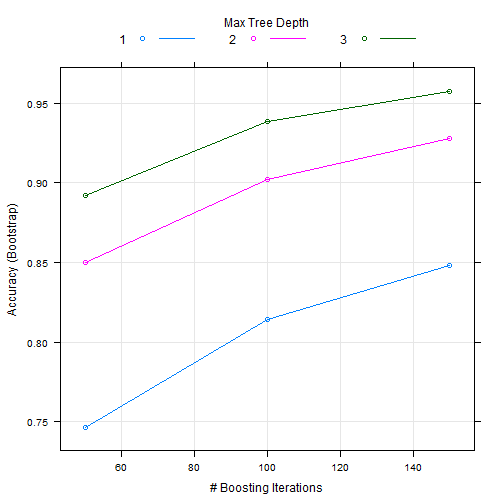
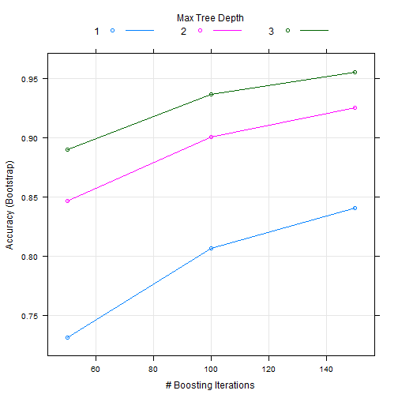

## Executive Summary

From a report called the "Qualitative Activity Recognition of Weight Lifting Exercises" by a group of Brazilian researchers, we get a data set that distinguishes 5 styles of curling a dumbbell, 1 of which is qualitatively correct with the remaining 4 showcasing typical mistakes people make when performing this exercise.

For this analysis, I will model the data provided to predict which type of curl was performed based on the data collected from 4 different sensors applied to the test subjects' body.

There are two data sets provided. The first will be used to train and test a model. This data set has 159 different variables collected about the subjects and their sensor output along with the type of curl they performed.

The second data set has the same variables excluding the curl type with only 20 total observations. This will be used as the final test set to generate a prediction set to be used for grading.

## Analysis

First, read in the data set. Then I want to narrow down the variables to use in training the model, since so many of them are largely composed of NAs as well as blank spaces. Also, the first 7 columns don't appear to be very useful in predicting the type of exercise so I'll leave those out as well.

pmldata is my training set from which I will also create a cross-validation set. pmltesting is my final submission data set that I will run my final model on for submitting for class credit.

Everything I do to the training set I will do to my submittal set as well.


```r
pmldata <- read.csv("pml-training.csv",stringsAsFactors=FALSE)
pmlfinaltest <- read.csv("pml-testing.csv",stringsAsFactors=FALSE)


# subtract off 1st 7 cols
pmldata <- pmldata[, -c(1:7)]   
pmlfinaltest <- pmlfinaltest[, -c(1:7)]


#remove cols with any NAs
pmldata <- pmldata[, colSums(is.na(pmldata)) == 0]   
pmlfinaltest <- pmlfinaltest[, colSums(is.na(pmlfinaltest)) == 0]


#remove cols with any blank spaces
pmldata <- pmldata[, colSums(pmldata == "") == 0]   
pmlfinaltest <- pmlfinaltest[, colSums(pmlfinaltest == "") == 0]

dim(pmldata); dim(pmlfinaltest)
```

```
## [1] 19622    53
```

```
## [1] 20 53
```


Now, I want to try some pre-processing to see if there's anything to be gained by dropping more variables. Since all of the variables are continuous numbers, I won't need to use any dummy variables; only the outcome, classe, is a factor.

Let's look to see if there's anything zero or near-zero variance predictors. Not a big deal for tree-based models, which I will focus on here, but it's easy to check.


```r
nzv<-nearZeroVar(pmldata[,-53])

nzv
```

```
## integer(0)
```

So, no problems there. Now, let's see if there are any variables that are highly correlated, thus making them redundant.

First, I'll create the correlation matrix for pmltrain[,-53]. (Just removing the outcome, classe, column(53) for the purpose of these pre-processing functions.) Then I'll run the findCorrelation function to see which variables I might remove.


```r
corpml <- cor(pmldata[,-53])

highcor <- findCorrelation(corpml)

highcor
```

```
## [1] 10  1  9  8 31 33 18
```

Alright, so here's a list of 7 candidates for removal. I'll create two separate train/test data sets to compare: one with and without these correlated variables.


```r
pmldata2 <- pmldata[, -highcor]
pmlfinaltest2 <- pmlfinaltest[, -highcor]

dim(pmldata2); dim(pmlfinaltest2)
```

```
## [1] 19622    46
```

```
## [1] 20 46
```


Next, I'll split both of the training data sets into training and testing sets for cross-validation. pmlfinaltest and pmlfinaltest2 will only be used for final submission as they don't have the classe variable included


```r
set.seed(1234)

intrain <- createDataPartition(y=pmldata$classe, p = 0.7, list = FALSE)

pmltrain <- pmldata[intrain,]

pmltest <- pmldata[-intrain,]

set.seed(1234)

intrain <- createDataPartition(y=pmldata2$classe, p = 0.7, list = FALSE)

pmltrain2 <- pmldata2[intrain,]

pmltest2 <- pmldata2[-intrain,]


dim(pmltrain); dim(pmltest); dim(pmltrain2); dim(pmltest2)
```

```
## [1] 13737    53
```

```
## [1] 5885   53
```

```
## [1] 13737    46
```

```
## [1] 5885   46
```


On my own I tested a few different models and discovered that the out-of-the-box gbm method using all the defaults gave me the best results. So I'll run gbm on each of these two training sets to see the results.


```r
tc<-trainControl(allowParallel=TRUE)

set.seed(1234)

fit1file<-"modelfit1.rds"

if(file.exists(fit1file)){
        
        fit1<-readRDS(fit1file)
        
} else {
        
        fit1<-train(factor(classe)~.,data=pmltrain, method = "gbm", verbose=FALSE, trControl=tc)
        
        saveRDS(fit1,"modelfit1.rds")
}

fit1; plot(fit1)
```

```
## Stochastic Gradient Boosting 
## 
## 13737 samples
##    52 predictor
##     5 classes: 'A', 'B', 'C', 'D', 'E' 
## 
## No pre-processing
## Resampling: Bootstrapped (25 reps) 
## Summary of sample sizes: 13737, 13737, 13737, 13737, 13737, 13737, ... 
## Resampling results across tuning parameters:
## 
##   interaction.depth  n.trees  Accuracy   Kappa      Accuracy SD
##   1                   50      0.7465000  0.6787898  0.007661781
##   1                  100      0.8140233  0.7647165  0.005904597
##   1                  150      0.8483889  0.8082045  0.004487342
##   2                   50      0.8502706  0.8103601  0.006094470
##   2                  100      0.9021746  0.8762053  0.003719941
##   2                  150      0.9278232  0.9086739  0.004201422
##   3                   50      0.8919061  0.8631787  0.005016480
##   3                  100      0.9388546  0.9226365  0.004320664
##   3                  150      0.9574633  0.9461929  0.003391998
##   Kappa SD   
##   0.009711707
##   0.007360592
##   0.005601523
##   0.007666457
##   0.004669395
##   0.005301706
##   0.006276647
##   0.005460525
##   0.004281762
## 
## Tuning parameter 'shrinkage' was held constant at a value of 0.1
## 
## Tuning parameter 'n.minobsinnode' was held constant at a value of 10
## Accuracy was used to select the optimal model using  the largest value.
## The final values used for the model were n.trees = 150,
##  interaction.depth = 3, shrinkage = 0.1 and n.minobsinnode = 10.
```

 


```r
set.seed(1234)

fit2file<-"modelfit2.rds"

if(file.exists(fit2file)){
        
        fit2<-readRDS(fit2file)
        
} else {
        
        fit2<-train(factor(classe)~.,data=pmltrain2, method = "gbm", verbose=FALSE, trControl=tc)
        
        saveRDS(fit2,"modelfit2.rds")
}

fit2; plot(fit2)
```

```
## Stochastic Gradient Boosting 
## 
## 13737 samples
##    45 predictor
##     5 classes: 'A', 'B', 'C', 'D', 'E' 
## 
## No pre-processing
## Resampling: Bootstrapped (25 reps) 
## Summary of sample sizes: 13737, 13737, 13737, 13737, 13737, 13737, ... 
## Resampling results across tuning parameters:
## 
##   interaction.depth  n.trees  Accuracy   Kappa      Accuracy SD
##   1                   50      0.7312118  0.6593756  0.008013170
##   1                  100      0.8064522  0.7550889  0.005728279
##   1                  150      0.8407249  0.7984884  0.004960118
##   2                   50      0.8466067  0.8057507  0.005004962
##   2                  100      0.9004770  0.8740654  0.005174721
##   2                  150      0.9255373  0.9057855  0.005110418
##   3                   50      0.8897028  0.8603835  0.004672579
##   3                  100      0.9365321  0.9196914  0.004385302
##   3                  150      0.9553332  0.9434948  0.003408476
##   Kappa SD   
##   0.010168757
##   0.007163782
##   0.006180031
##   0.006307617
##   0.006516105
##   0.006462103
##   0.005836457
##   0.005562187
##   0.004336985
## 
## Tuning parameter 'shrinkage' was held constant at a value of 0.1
## 
## Tuning parameter 'n.minobsinnode' was held constant at a value of 10
## Accuracy was used to select the optimal model using  the largest value.
## The final values used for the model were n.trees = 150,
##  interaction.depth = 3, shrinkage = 0.1 and n.minobsinnode = 10.
```

 

## Results

As you can see from these results, fit1 does slightly better than fit2. Leaving in more variables allows the boosting method to do a better a job.

Here are the confusion matrices to see how well each performs. Again, predictions from fit1 do a bit better. I've also include the missclassification rate


```r
pred1<-predict(fit1,pmltest)
```

```
## Warning: closing unused connection 7 (<-act2.mediafour.com:11714)
```

```
## Warning: closing unused connection 6 (<-act2.mediafour.com:11714)
```

```
## Warning: closing unused connection 5 (<-act2.mediafour.com:11714)
```

```r
confusionMatrix(pred1,pmltest$classe)
```

```
## Confusion Matrix and Statistics
## 
##           Reference
## Prediction    A    B    C    D    E
##          A 1651   42    0    0    1
##          B   15 1067   29    4    7
##          C    5   26  984   23   12
##          D    3    3   10  928   12
##          E    0    1    3    9 1050
## 
## Overall Statistics
##                                           
##                Accuracy : 0.9652          
##                  95% CI : (0.9602, 0.9697)
##     No Information Rate : 0.2845          
##     P-Value [Acc > NIR] : < 2.2e-16       
##                                           
##                   Kappa : 0.9559          
##  Mcnemar's Test P-Value : 4.552e-05       
## 
## Statistics by Class:
## 
##                      Class: A Class: B Class: C Class: D Class: E
## Sensitivity            0.9863   0.9368   0.9591   0.9627   0.9704
## Specificity            0.9898   0.9884   0.9864   0.9943   0.9973
## Pos Pred Value         0.9746   0.9510   0.9371   0.9707   0.9878
## Neg Pred Value         0.9945   0.9849   0.9913   0.9927   0.9934
## Prevalence             0.2845   0.1935   0.1743   0.1638   0.1839
## Detection Rate         0.2805   0.1813   0.1672   0.1577   0.1784
## Detection Prevalence   0.2879   0.1907   0.1784   0.1624   0.1806
## Balanced Accuracy      0.9880   0.9626   0.9727   0.9785   0.9839
```

```r
pred2<-predict(fit2,pmltest2)
confusionMatrix(pred2,pmltest2$classe)
```

```
## Confusion Matrix and Statistics
## 
##           Reference
## Prediction    A    B    C    D    E
##          A 1648   36    0    0    2
##          B   19 1068   34    6   12
##          C    4   27  977   22   13
##          D    2    2   12  923   16
##          E    1    6    3   13 1039
## 
## Overall Statistics
##                                           
##                Accuracy : 0.9609          
##                  95% CI : (0.9556, 0.9657)
##     No Information Rate : 0.2845          
##     P-Value [Acc > NIR] : < 2.2e-16       
##                                           
##                   Kappa : 0.9506          
##  Mcnemar's Test P-Value : 0.003887        
## 
## Statistics by Class:
## 
##                      Class: A Class: B Class: C Class: D Class: E
## Sensitivity            0.9845   0.9377   0.9522   0.9575   0.9603
## Specificity            0.9910   0.9850   0.9864   0.9935   0.9952
## Pos Pred Value         0.9775   0.9377   0.9367   0.9665   0.9783
## Neg Pred Value         0.9938   0.9850   0.9899   0.9917   0.9911
## Prevalence             0.2845   0.1935   0.1743   0.1638   0.1839
## Detection Rate         0.2800   0.1815   0.1660   0.1568   0.1766
## Detection Prevalence   0.2865   0.1935   0.1772   0.1623   0.1805
## Balanced Accuracy      0.9877   0.9614   0.9693   0.9755   0.9777
```

```r
#to get an out of sample missclassification error rate:

1 - confusionMatrix(pred1,pmltest$classe)$overall[1]
```

```
##   Accuracy 
## 0.03483432
```

```r
1 - confusionMatrix(pred2,pmltest2$classe)$overall[1]
```

```
##   Accuracy 
## 0.03908241
```

Here, I finally run the predictions on the the final testing data for submission. As you can see there is no difference between the two.

According to the submission results, all of these results are correct. I would seem then that Stochastic Gradient Boosting with it's default parameters is pretty good model to use for predicting large variable datasets like this.


```r
finalpred1<-predict(fit1,pmlfinaltest)
finalpred2<-predict(fit2,pmlfinaltest2)

finalpred1;finalpred2
```

```
##  [1] B A B A A E D B A A B C B A E E A B B B
## Levels: A B C D E
```

```
##  [1] B A B A A E D B A A B C B A E E A B B B
## Levels: A B C D E
```

